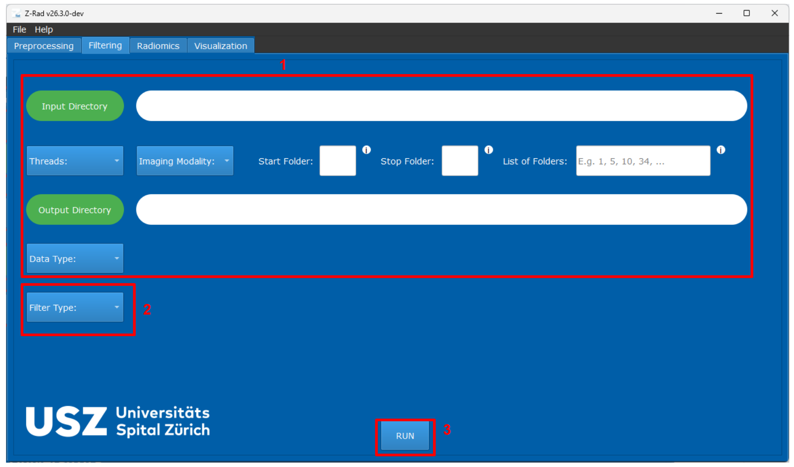

# Z-Rad: Data Filtering

The upper part <b>(1)</b> of the Filtering tab is identical to the Preprocessing tab, with the only exception that the user does not need to provide structure names, as filtering is performed on the images alone.

The Filter Type section <b>(2)</b> allows the user to choose one of the supported filters, including <b>Mean</b>, <b>Laplacian of Gaussian</b>, <b>Gabor</b>, <b>Laws kernels</b>, and wavelet filters (<b>Daubechies 2</b>, <b>Daubechies 3</b>, <b>first-order Coiflet</b>, and <b>Haar</b>).

Once a filter is selected, a set of filter-specific parameters appears, which must be filled in by the user. For a detailed description of all filter-specific parameters, please refer to IBSI II, where they are covered in great detail. Z-Rad’s implementation is also fully based on IBSI II.

Fig. 1 shows examples of different applied filters on the IBSI II phantom.

By pressing RUN <b>(3)</b>, the filtering process is executed, and the filtered images are saved in the specified output directory.

# Examples
