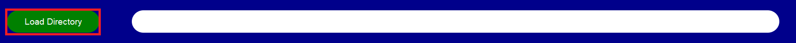

# RAD: Resampling

## Accessing the Resampling Tab

To perform resampling with RAD, click on the 'Resampling' tab located at the top-left corner of the menu.

## Setting Up Directories

Specify the **load directory** (the directory containing patient folders) by either:
- Clicking on 'Load Directory' and navigating to the folder.
- Copying the directory path into the field to the right of the 'Load Directory' button.

## Configuring Resampling Options

### Imaging Modality
Select the imaging modality (supported options: PET, CT, and MR). For details on how RAD processes each modality, refer to the GetStarted guide.

### Patient Folders
Options to specify patient folders include:
1. Input start and stop folders to run all folders within the specified range, keeping the patient folder list blank (Note: ALL folder names should be integers).
2. Define a specific list of patient folders without using start and stop folders (folders can include symbols and letters).
3. Leave the patient folder list, start, and stop folders blank; RAD will then process all folders in the 'Load Directory'.

### Processing
- Select the number of threads for parallel processing, keeping in mind the RAM limits of your machine.
- Specify the save directory; RAD will create it if it does not exist. Resampled images and masks will be saved in subfolders named after the original patient folders.

### Image Data Type
- **For DICOM**: Specify the studied structures list by typing your ROIs separated by commas. Use `ExtractAllMasks` to use all masks in the rtstruct file. Optionally, save DICOM data as NIFTI without resampling by selecting the corresponding option.
- **For NIFTI**: Specify the NIfTI structure files list by typing the file names separated by commas, excluding the file extension. Specify the NIfTI image including the file extension.

### Image Resizing
Define the resize resolution, image interpolation method (popular options include Linear and BSpline), and resample dimension (choose between 3D isotropic resampling or 2D anisotropic resampling).

### Interpolation Methods
Supported interpolation methods for images and masks include nearest neighbors, linear, BSpline, and Gaussian. For masks, the most popular interpolation strategies are NN and Linear with a default threshold of 0.5 (modifiable directly from the GUI).

## Final Steps
- **Save Input**: Save your configuration by going to the menu and clicking 'Save Input', or using the shortcut 'Ctrl+S'.
- **Load Input**: Load a previously saved configuration by selecting 'Load Input' or pressing 'Ctrl+O'.
- **Run Resampling**: Fill all fields, select your options, and click the 'RUN' button. Monitor the resampling progress in the console.
