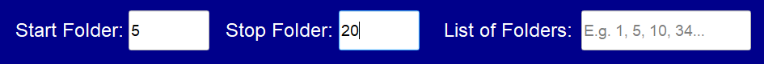
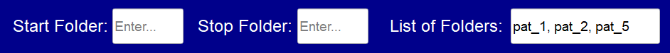
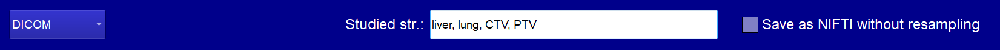

# RAD: Resampling

## Accessing the Resampling Tab

To perform resampling with RAD, click on the `Resampling` tab located in the menu at the top-left corner.

## Setting Up Directories

Specify the **load directory** (the directory that contains patient folders) by either:
- Clicking on `Load Directory` and navigating to the folder.
- Copying the directory path into the blank field to the right of the `Load Directory` button.

Use the same approaches to choose the **save directory** (the directory where resampled images and masks will be saved). 
Inside the save directory, each patient will be saved in a subfolder named after the original folder.
RAD will automatically create the provided save directory if it does not exist.

### Imaging Modality
Select the imaging modality (supported options: PET, CT, and MR). For details on how RAD processes each modality, refer to the [Get Started](get_started.md) guide.

## Select Patient Folders
Options to specify patient folders include:

- Input `start` and `stop` folders to run all folders within the specified range, keeping the `patient folder list` blank (Note: **ALL** folder names in the load directory should be integers).                                                                                                                                                                        

    **Exaple**: In my load directory I have six patient folders. These folders are named 1, 2, 5, 13, 20, 21. I want to resample only folders 5, 13, and 20. Thus I specify the `start` and `stop` folders accordingly:
    

    **Important**: Boundary folders (in the example above 5 and 20) should always exist!
     
- Define a specific `list of patient folders` without using `start` and `stop` folders (Note: folders can include symbols and letters).

     **Example**: In my load directory I have four patient folders. These folders are named pat_1, pat_2, pat_4, pat_5. I want to resample only folders pat_1, pat_2, and pat_5. Thus I specify the `start` and `stop` folders accordingly:
     
   
     **Important**: Selected folders should always exist!

- Leave the `patient folder list`, `start`, and `stop` folders blank; RAD will process all folders in the provided load directory. (Note: folders can include symbols and letters).

## Processing
- Select the number of threads for parallel processing. Rad calculates one patient at one thread at a time. Keep in mind the RAM limits of your machine.

## Configuring Resampling Options

### Image Data Type
#### DICOM:
- Specify the studied structures list by typing your ROIs separated by commas.

     **Example**: In my RTstruct file I have liver, lung, CTV, PTV, and GTV. I am interested only in liver, lung, CTV, and PTV structures. Thus, I write:
     

     **Important**: If one or more selected structures do not exist, Rad will skip them.
- Type `ExtractAllMasks` to use all masks from the RTstruct file.
- Leave `Studied str.` blank if you want only to resample the image without any masks.
- Optionally, save DICOM data as NIFTI without resampling by ticking the corresponding checkbox (if `Studied str.` is specified, corresponding masks will be saved as separate NIfTI files).

- **For NIFTI**: Specify the NIfTI structure files list by typing the file names separated by commas, **excluding** the file extension. Specify the NIfTI image **including** the file extension.

### Image and Masks Resampling
- Define the resample resolution (in mm) - a resolution to which the image and masks will be resampled;
- Choose an image interpolation method (the most popular options include Linear and BSpline);
- Choose a mask interpolation method (the most popular options are Nearest Neighbors (NN) and Linear with a default threshold of 0.5).
- Choose resample dimension: 3D isotropic or 2D anisotropic (in-plane resampling, while keeping the original spacing in the z-direction).

## Optional Steps
- **Save Input**: Save your configuration by going to the `File ` menu and clicking `Save Input`, or using the shortcut 'Ctrl+S'.
- **Load Input**: Load a previously saved configuration by navigating to the `File` menu and selecting `Load Input` or pressing 'Ctrl+O'.
## Run the Configuration
When all fields are filled, click the `Run` button and monitor the resampling progress in the console.
