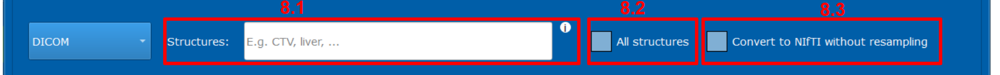

# Z-Rad: Data Preprocessing

The tab panel <b>(1)</b> allows navigation between different sections of the application; currently, the Preprocessing tab is active. To select the input directory, use the corresponding button <b>(2)</b>.

To process multiple folders (e.g., <code>folder_1</code>, <code>folder_2</code>, …, <code>folder_n</code>), the selected path should point to <code>main_path/data_folder</code> (see the data structure section).

The number of threads <b>(3)</b> defines how many processes run in parallel, with each process handling one folder at a time. 
<b>Note:</b> Increasing the number of threads may speed up processing but can also overload the system, so it should be chosen carefully based on available resources.

The imaging modality <b>(4)</b> must match the dataset (CT, PET, MRI, mammography, or 3D dose distribution), ensuring that appropriate preprocessing settings are applied. All images processed together must share the same modality.

The range of folders to process can be defined using Start Folder / Stop Folder <b>(5)</b>; however, this option is only applicable when folder names are numeric. Alternatively, specific folders can be selected explicitly using the List of Folders <b>(6)</b>. 
<b>Note:</b> If both <b>(5)</b> and <b>(6)</b> remain empty, all folders within <code>data_folder</code> will be processed, which is the simplest way to run the pipeline on the entire dataset.

The output directory <b>(7)</b> specifies where the processed data will be saved. If the specified directory does not exist, it will be created.

Under Data Type <b>(8)</b>, select whether the input data is in DICOM or NIfTI format.

<ul>
<li>
For DICOM data, specific RTSTRUCT structures can be selected <b>(8.1)</b>, or all available non-empty structures can be processed <b>(8.2)</b>. Additionally, selecting <b>(8.3)</b> allows saving both the DICOM images and chosen RTSTRUCT structures as NIfTI files without modification.
</li>
<ul>

<ul>
<li>
For NIfTI data, the names of mask files <b>(8.4)</b> can be specified and processed together with the corresponding image <b>(8.5)</b>.
</li>
</ul>

<b>Note:</b> If a specified structure or mask is not found, it will be skipped.

The Resample Resolution <b>(9)</b> defines the target voxel spacing in millimeters. The Mask Union option <b>(10)</b> allows multiple masks to be combined into a single mask during preprocessing.

For interpolation, select the desired method for images <b>(11)</b>, with available options including Nearest Neighbor, Linear, B-Spline, and Gaussian. The Resample Dimension <b>(12)</b> determines whether resampling is applied in 2D or 3D.

For masks <b>(13)</b>, the same interpolation methods are available. When using methods other than Nearest Neighbor, a threshold must be defined since these methods produce values in the range <code>[0, 1]</code>. The default threshold is <code>0.5</code>, meaning values below <code>0.5</code> are set to <code>0</code> and values equal to or above <code>0.5</code> are set to <code>1</code>.

After configuring all parameters, press RUN <b>(14)</b> to start the preprocessing pipeline.

<b>Note:</b>

<ul>
<li>
Save Input: Save your configuration by going to the File menu and clicking Save Input, or using the shortcut <code>Ctrl+S</code>.
</li>
<li>
Load Input: Load a previously saved configuration by navigating to the File menu and selecting Load Input or pressing <code>Ctrl+O</code>.
</li>
</ul>

# Examples: 

## IBSI I Config. B (DICOM): 

* Studied structure: GTV-1;
* Slice-wise resampling (2D);
* Linear interpolation 2mm × 2mm (axial);
* Linear ROI interpolation;
* ROI rounding threshold 0.5.

## IBSI I Config. B (NIFTI): 

* Studied structure: mask;
* NIfTI image: phantom.nii.gz;
* Slice-wise resampling (2D);
* Linear interpolation 2mm × 2mm (axial);
* Linear ROI interpolation;
* ROI rounding threshold 0.5.

## IBSI I Config. C and D (DICOM):

* Studied structure: GTV-1;
* Single volume (3D) resampling;
* Linear interpolation 2mm × 2mm × 2mm;
* Linear ROI interpolation;
* ROI rounding threshold 0.5.

## IBSI I Config. E (NIFTI):

* Studied structure: mask;
* NIfTI image: phantom.nii.gz;
* Single volume (3D) resampling;
* BSpline interpolation 2mm × 2mm × 2mm;
* Linear ROI interpolation;
* ROI rounding threshold 0.5.

  
  
