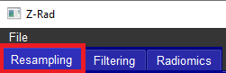

# RAD: Resampling

To perform resampling with RAD, navigate to the respective tab by clicking on 'Resampling' at the top-left corner of the menu.

  

Specify the load directory (the directory with patient folders).

  

Then choose the image modality (supported PET, CT, and MR, on how Rad process each modality refer to the GetStarted).
One has three different possibilities how to specify patient folders:

1) Input start and stop folders to run all folders within the defined range and keep the list of patient folders blank (Note, all folder names should be ONLY integers);

2) Define a list of patient folders, while not specifying start and stop folders.

3) Leave start, stop and list of folders blank, in this case, Rad will go through all folders in the provided directory (Note, folders can contain symbols and letters)

Choose the number of threads to run Rad for multiple patients in parallel. But take in mind the RAM limits of your machine!

Specify the save directory. If the directory does not exist, Rad will create it. Inside the save directory, RAD will create folders with the original patient folder names where the resampled image and mask will be saved.

Specify the image data type (supported DICOM and NIFTI).

If one works with DICOM files, there is an option to just save them as NIFTI without resampling, for this tick the corresponding box.

Define the resize resolution as a resolution - the resolution of the output mage, followed by the image interpolation method (most popular are linear and BSpline imterpolations) and resample dimension (3D - to resample image in all three dimensions or 2D - to resampe only inplane but keep the z spacing as original).

Currently, RAD supports nearest neighbors, linear, BSpline, and Gaussian interpolation methods for both image and mask interpolations.

For the mask interpolation strategies the most popular are NN and Linear with the threshold of 0.5, note that one can change the threshold directly from GUI if needed.

When all fields are filled and comboboxes are chosen, we recommend saving the input by going to the menu and pressing 'Save Input', or simply by using the shortcut 'Ctrl+S'. Already saved input can be loaded through the menu by choosing 'Load Input' or by pressing 'Ctrl+O'.

When all fileds are filled press 'RUN' button. On the console you should be able to track the resampling progress.
