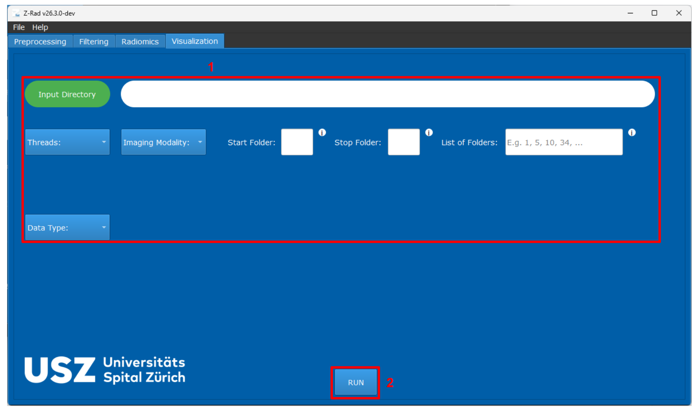
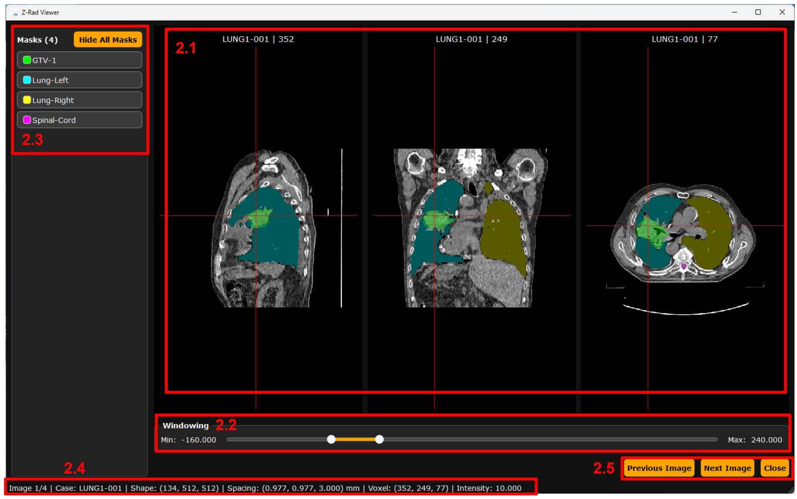

# Z-Rad: Visualization

The upper part <b>(1)</b> of the Visualization tab is identical to the Preprocessing tab, with the only exception that the user does not need to provide an output directory.

By pressing RUN <b>(2)</b>, the images are loaded and displayed in a separate dedicated window.

The upper part <b>(2.1)</b> displays three projections. These can be scrolled through and zoomed in, and double-clicking on a selected projection opens it in full screen for easier visual assessment.

Windowing <b>(2.2)</b> allows the user to select a comfortable intensity range.

Masks in <b>(2.3)</b> can be individually hidden by clicking on the corresponding mask, or all masks can be hidden at once by pressing the <b>“Hide All Masks”</b> button.

Section <b>(2.4)</b> provides important information about the loaded image, such as progress through the images, the current folder name, the shape of the image array, voxel spacing, voxel coordinates where the crosshair is currently pointing, and the intensity at that voxel.

Using <b>(2.5)</b>, the user can navigate through the images.

